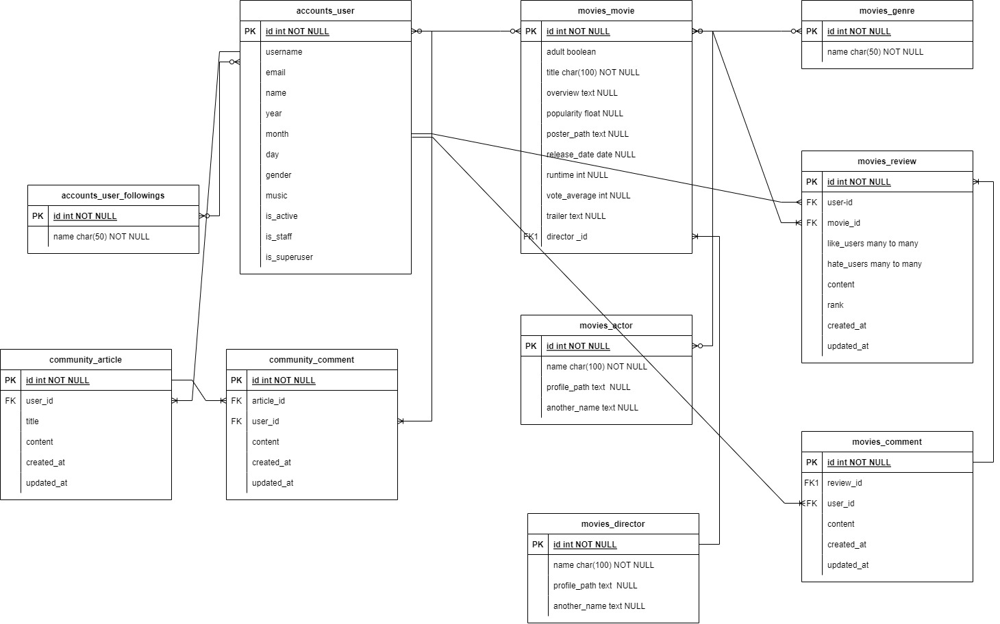
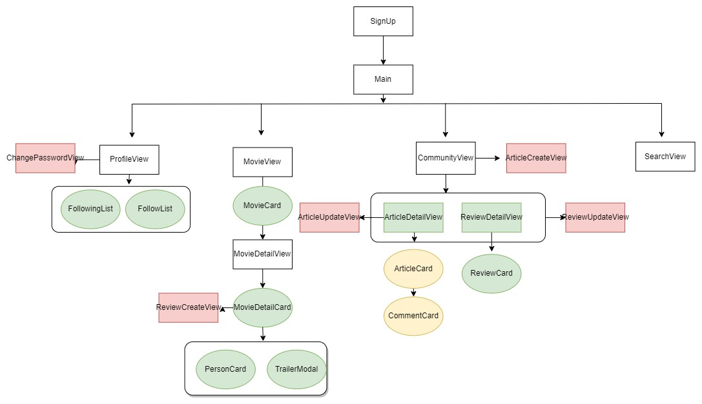

# 프로젝트 이름
#### 뮤무 (music + movie)

## 팀 소개
| 강성권 | 팀장 |[back,front] 메인과 영화 관련 상세 [back] 커뮤니티|  
| :---: | :--: | :--: | 
| 이현비 | 팀원 | [back, front] 유저 인증 과정 [back] 팔로우, 좋아요 기능 [front] 리뷰, 프로필|

## 프로젝트 소개

음악과 영화는 개개인의 취향 반영도가 높다는 공통점이 있다. 이를 활용하여 사용자가 좋아하는 음악 장르 정보를 수집하고, 다른 사용자들과의 연관성을 토대로 영화를 추천해주는 프로젝트이다.

 

## 기술 스택

 

## ERD

## Component

 

## 목표 서비스 구현 및 실제 구현 정도
### 영화 목록 및 상세 ⭐⭐⭐⭐⭐
### 영화 검색 기능 ⭐⭐⭐⭐⭐
### 선택한 음악 장르를 같이 좋아하는 유저들의 영화 추천 ⭐⭐⭐⭐⭐
### 회원 가입, 로그인 로그아웃 ⭐⭐⭐⭐
### 커뮤니티 게시판, 영화에 대한 리뷰 ⭐⭐⭐⭐
### 프로필 팔로우 팔로워 기능 ⭐⭐⭐⭐⭐

## 구현 기능
### 기능 1
- 영화 최신, 인기, 장르, 개봉예정작, 맞춤 추천에 맞는 영화 리스트 응답
### 기능 2
- 키워드를 입력시 해당 관련 영화들 응답
### 기능 3
- 영화 리스트 응답시 한번에 받는 것이 아닌 vue3-infinite-loading 라이브러리 무한 스크롤 기능으로 적당양의 데이터만 받아오는 기능
### 기능 4
- 영화 상세 정보 표현 및 해당 영화에 대한 리뷰 작성과 좋아요, 유튜브 API 통한 예고편 모달 기능
### 기능 5
- Django rest_auth 라이브러리를 활용하여 정보를 수정하여서 커스텀 유저를 회원가입, 로그인, 로그아웃 기능 구현
### 기능 6
- 커뮤니티 게시글 생성과 게시글에 대한 리뷰, 리뷰 좋아요 수정 삭제까지
### 기능 7
- 프로필 팔로우, 팔로워 기능과 목록, 좋아요한 영화 목록 출력
 

## 이슈

- 검색 시 route.push할 때 params가 넘어가는데도 새로고침 해야만 값이 나타났다.
=> 컴포넌트 재사용이 원인임을 깨닫고, onBeforeRouteUpdate(컴포넌트 가드)를 사용하여 해결하였다.

- 권한(401오류)에 관한 오류가 발생하였다. => hearders에 token지정하여 해결하였다.

- git push를 잘못하였다. => git에 있는 파일을 압축하여 다운로드받아서 해결하였고, git에 대한 추가적으로 공부하여 이후 관련된 트러블이 발생하지 않았다.

- 팔로우, 팔로워 기능 구현 시 새로고침 하면 값은 저장되는데, 팔로우 후 팔로우 취소로 바꼈는데 새로고침하면 다시 팔로우로 바꼈다.
=> setTimeout을 사용해서 서버가 정보를 받을 시간을 주었다.

- api요청을 통해 받아온 데이터를 또 다시 api요청을 보내서 데이터를 받아오는 과정에서 어떤 데이터를 가져와야 하는지 혼란을 겪었다.

- main 페이지에서 인기순 , 최신순 으로 클릭시 새로고침을 해야 화면이 변경되는 문제 생겼다. => v-for에서 key를 사용해 주어 해결하였다.

- 에러 발생 시 사이트가 동작하지 않아 기능 구현 확인이 어렵다. => optional chaning(중첩된 object 자료에서 에러 없이 데이터를 뽑아낼 때 사용 중첩 데이터에서 상위 데이터가 없다면 에러가 아닌 undefined 출력)을 통해 해결하였다.

- 컴포넌트를 재사용하여 화면을 랜더링 할 때 데이터가 바뀌었지만 요소들이 바뀌지 않음 v-for를 진행할 때 key를 넣어주어 순서의 변경에 따라 요소 순서 변경 존재하지 않는 key는 제거 등 렌더링 오류를 막아주었음

- django-rest-auth를 사용하여 비밀번호를 변경할 때 기존 비밀번호가 틀려도 변경이 된다. => 공식 문서를 세세하게 보지 않아 발생한 문제였고, settings에서 REST_AUTH안에 넣어주어 해결하였다.

## 느낀점

### 강성권
- 처음으로 명세가 주어지지 프로젝트를 진행하려고 보니 나름 설계를 하고 진행했다고 생각했음에도 불구하고 계속 늘어나는 컴포넌트에 의해 전체적인 구조가 망가지는 듯한 느낌이 자주 들었습니다. 그러다 보니 불필요하게 다시 재호출되는 데이터들도 많고
데이터가 제대로 DOM에 반영이 되지 않는 경우도 자주 생겼습니다. 공통으로 사용되고 보안 위험이 적은 데이터는 pinia를 통해 로컬 스토리지에 저장하여 중앙 저장소에서 가져다 쓰는 방식을 사용해 해결하였습니다. 또한 팀을 이루어 프로젝트를 진행했는데 배웠던 걸 다 활용해 보고 싶어서 front, back이 아닌 기능을 구현하는 것을 나누어 진행했는데 생각했던 것보다 더 어려웠습니다. 하지만 여러 기능들이 원하는 데로 동작하고 팀원과 계속해서 소통을 통해 더 나은 방향으로 프로젝트를 마무리 할 수 있게 되었습니다. 배웠던 거 뿐만 아니라 다양한 API와 라이브러리를 활용해 프로젝트를 구성하며 힘들면서도 배웠던 점이 정말 많았습니다.   
### 이현비 
-협업하며 완전한 프로젝트를 진행해보니 시간 내에 완성하기 위해선 초반 계획 과정이 정말 중요하단 걸 깨달았다. 초반에 코드를 작성하는 것보다 코드를 수정하는 것이 더 힘들다.. 그리고 프론트와 백을 왔다갔다 하며 상호호환 되는지 확인하는 것에 어려움을 많이 느꼈던 것 같다. 공식 문서를 자세히 들여다보면 정답이 있다는 것도 깨달았다. 온전한 개발 프로젝트를 한 것이 처음이라 힘든 점도 많았지만, 이번 프로젝트를 통해 더 성장한 거 같아 뿌듯함도 있다 ! 

 

